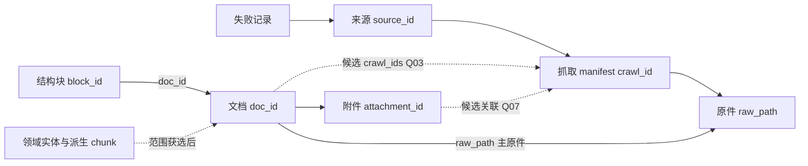

# 数据模型与字段规则

## 当前适用入口

已确认业务边界见 [raw 优先决定](raw-first-development.md)，当前实现缺口、任务顺序和完成标准统一见 [阶段五](stage-five.md)。本文历史阶段判断不覆盖该入口；已决定的范围不重复确认，已有能力不重新开发。

版本：0.1.0｜日期：2026-09-11｜状态：评审草案，尚未批准为实施基线

本文件以 S1 原字段表为采集基础，并单列原文正文补充字段、S2 领域对象以及本次候选设计。JSON Schema 是评审草案，其可执行语法不代表业务已批准。引用、哈希含义和原件存在性等关系约束需额外语义校验。

## 核心对象和关系

一个来源可有多个抓取记录；一个物理原件可被多个抓取记录引用（Q05 候选）。一份文档可关联多个取得其内容的响应（Q03 候选）。一份文档的块按 order 保序；块不能跨文档无说明复用。附件是独立资源，不保证都已解析成文档。失败不一定存在 manifest，例如连接失败尚未取得字节；解析失败则应保留已成功获取的原件和账本。

## S1 字段字典的完整来源

本套 [manifest.schema.json](contracts/manifest.schema.json)、[document.schema.json](contracts/document.schema.json)、[block.schema.json](contracts/block.schema.json)、[failure.schema.json](contracts/failure.schema.json) 将原字段表转成候选机器规则。下列层级按原文保留，新增格式约束在契约说明中标注。

### 抓取记录

必填：crawl_id、source_id、requested_url、final_url、crawl_time、http_status、content_type、raw_path、sha256、discovery_method。建议：referrer_url。条件必填：站内搜索发现时 keyword。可选：etag、last_modified。

S1 列举 discovery_method 为 list/search/sitemap/api/attachment/manual；机器契约按该集合编码为候选枚举。S1/S2 同时提到 RSS、浏览器兜底和限域发现，但未给新枚举值；不擅自归到 manual 或 sitemap，应由 Q12 冻结映射。2026-09-13：实现在执行器已使用两个扩展值并写入账本——`pagination`（正文分页的后续部分，与母页同文档、按部分序号合并）与 `retry`（失败补抓重取）。机器契约把两者列入枚举并在描述中标注为候选扩展、待 Q12/Q15 冻结；未把它们改名成 manual 或 sitemap 以规避决策。raw_path 相对于配置的数据根；开发默认项目根下 data/，生产通过 CRAWL_DATA_DIR 指定绝对路径，见 [项目起步说明](project-startup.md)。manifest.sha256 明确为原始字节 SHA-256。

### 文档

必填：doc_id、source_id、source_name、source_url、title、full_text、language、document_type、raw_path、sha256、crawl_time、extraction_method、parse_status。

建议：canonical_url、publication_date、issuer、category_hint、section_path、version、is_current。可选：attachments。按需：effective_from、effective_to（date/null）。日期按 YYYY-MM-DD，时间采用带时区的 ISO 8601 候选规则。parse_status 为 ok/partial/failed。language 及 document_type 示例不是已封闭枚举；保留字符串。category_hint 可多值，但不表示最终多分类规则已确定。

document.sha256 在 S1 中允许正文或原文件哈希，基础 schema 保留这个含义；ADR-003 候选才建议统一为原件并另加 content_hash。source_name 不等于 issuer：网站来源与文件发布机关可能不同。publication_date 不等于 event_date、签署或生效时间。

### 结构块

必填：block_id、doc_id、order、block_type、extraction_method。text 条件必填；表格可另存 structured_data。建议：heading_level（integer/null）、section_path、source_anchor（string/object）。PDF/扫描件建议：page_no（integer/null）。法规/条约建议：article_no（string/null）。表格等建议：structured_data（object/null）。OCR/自动抽取可选：confidence（number/null，0—1）。

2026-09-13 实现扩展（不改变必填层级）：`extraction_method` 采用 `<基础抽取>+<分块器>_<版本>` 形式，
例如 `bs4_lxml_dom+structural_blank_line_v1`、`bs4_lxml_selector+structural_blank_line_v1`、`pre_parsed`；
分块器名称与版本可识别，便于区分 dummy 与后续替换实现。契约把该字段定义为开放字符串，格式约定不构成新枚举。

order 原文允许从 0 或 1 开始，基础 schema 只规定非负整数；候选统一起点 0 尚属 Q09。block_type 的 title/heading/paragraph/list_item/table/table_row/page_note/image_caption 等是示例，不封死其他原文结构。对 table/table_row，候选规则允许有非空 text，或有非空 structured_data；其他块必须有 text 字段。真实内容完整性不能只看字段存在。

source_anchor 可记录 DOM selector、paragraph_index、page_no、article_no、sheet/range 等，但这些子字段并没有统一必填集合。HTML 正文分页合并时，候选实现用同一 page_no 记录正文部分序号（1..n，翻页控件不入正文）；这是本项目的实现约定，不是 S1 的字段新定义，若 Q09 冻结顺序语义需一并复核。原文对引用和页码的验收目标比部分字段的“建议”等级更强，按 NFR-001、FR-011 和入选 S2 条件检查，不能简单把所有 source_anchor 升成全对象必填。

### 失败记录

至少包含 source_id、url、time、stage、error_type、message、retry_count、final_action。2026-09-13 实现扩展：可选
`scope_start_date`（YYYY-MM-DD）记录该失败发生时所处运行的内容发布日期下界，供恢复任务保留原窗口；
缺省为空表示原运行未设起始日，不改变失败核心字段与必填层级。S1 未给完整字段类型表，契约类型和重试计数非负约束是合理的候选工程表达。stage 保持开放字符串，fetch/download/parse/normalize 为推荐值。重试成功不能抹去原失败事实；补抓关联字段需 Q15 定稿。

## S1 正文中的补充字段

| 字段 | 原文依据 | 本次处理 |
| --- | --- | --- |
| raw_date | S1 §9 | 无法判定日期时保存原字符串；不编造标准日期 |
| duplicate_of / related_doc_ids | S1 §3.3 | 保留重复/相关关系概念；候选类型分别 string、string 数组，指向谁和何时用待 Q05 |
| source_status | S1 §11 | 页面下线记录 offline 等状态；不据此删除文档 |
| 附件身份 文件名 类型 URL 路径 哈希 | S1 §3.3 | 原文列出了信息项，未给完整对象表；附件 schema 单独标为候选扩展 |
| records | S1 §8 | 原文出现产出概念，但无独立文件名/schema；Q08 未决，不能伪装已有最终接口 |

## 本次新增的候选字段

document.crawl_ids、document.content_hash 以及附件对象的 doc_id/crawl_id/status 是为追溯和状态明确而提出的候选。正文分页或接口正文部分获取失败时，候选实现不新增文档字段：原因写入 metadata_missing 标记（`pagination_*` / `body_api_*`）并把 parse_status 置为 partial，失败本身仍进失败账。基础 document schema 允许它们但不将其加入 S1 原始必填集合；若 Q03/Q04/Q07 采纳，需要冻结实施版本并把相关约束提升为正式契约。缺失理由可暂记运行质量报告，不强制新增一套未知业务状态。

## S2 来源和领域模型

以下保留来源字段和对象概念，不宣称已构成完整可上线的领域 schema。物理文件名、主键生成、字段必填等级及对文档的关系要在 Q02/Q09 定稿。S2 §18 的对象专项最低要求仍须执行。

| 对象 | 原文字段或组织键 | 引用与限制 |
| --- | --- | --- |
| 来源注册表 | source_id/source_name/base_domain/country/authority_level/categories/allowed_paths/blocked_paths/crawl_mode/update_interval/parser_type/language/stance_default/robots_policy/terms_checked_at/last_success_at/last_content_hash/error_count/owner/adapter | 均来自 S2 §11 的建议字段；allowed_domains 来自 S1，合并配置是候选。`robots_policy` 记录逐站核验结论（T026）；robots.txt 的获取与执行由客户端按 FR-001 自动完成，不依赖该文本字段。`adapter` 是 T026 机制部分新增的候选块（list_link_selector/list_link_pattern/list_link_rewrite/attachment_pattern/pagination_selector/max_pages/content_selector/date_selector），逐来源取值待 Q12/Q13；未配置时使用通用规则 |
| 通用文档或片段 | doc_id/chunk_id/title/text/source_name/source_url/source_country/source_authority/document_type/topic/publication_date/event_date/effective_from/effective_to/version/is_current/language/jurisdiction/stance/citation_anchor/content_hash/supersedes/superseded_by/抓取时间 | S2 §3 为建议；不是要求每个 document 必须同时具有 chunk_id |
| A 协定 | agreement_id，签署/生效、正式语言、条款、双方名称、引用锚点 | 一份协定的语言和版本分别保留；条款切片属领域对象 |
| B 政策表述 | stance/speaker/organization/event_date/publication_date/issue_tags/related_agreement_ids | 发布机构、时间和立场按 S2 §18 强制保留；联合文件不因站点国别自动标单方 |
| C 法规 | 公布、施行、有效性、修改/废止、章条/Section；jurisdiction | 沿革和时效强制保留；缺失须列异常，不能默认有效 |
| D 事件 | event_id/event_date/location/actors/topic/cn_official_statement_ids/in_official_statement_ids/bilateral_statement_ids/agreements_referenced/followup_event_ids/source_ids/confidence | 来源声明分立场挂接；内部材料独立受控导入 |
| E 文化 | region_id + community_id + topic；source_region/source_authority/适用范围 | 地方材料不泛化；统计数据保留区域层级和口径 |
| F 地理 | geo_id/canonical_name/aliases/language/lat/lon/admin_level/parent_geo_id/source/source_country/map_version/perspective/valid_from/valid_to | 地名、版本、来源地图视角分开；未知经纬度不猜测 |
| G 术语 | concept_id/zh/en/hi/aliases/entity_type/preferred_translation/source_ids/jurisdiction/valid_from/notes | 每种正式写法有原文依据；缺语言不自动补译 |
| 领域 chunk | source_url/citation_anchor/content_hash/crawl_time，PDF 加页码 | S2 §18 明确最低要求；doc/block/chunk ID 关系仍需领域契约 |

S2 的 source_authority、source_country 和 stance 不能与注册表 authority_level、country、stance_default 不加说明地改名合并。A1/A2/B/C 是证据等级；A—G 是知识类别。S2 B018 的等级规则按具体材料类型判断，不能仅因来自政府域名将所有材料升级成 A1。

## 跨对象校验与演进

doc_id、block_id、crawl_id 在约定范围唯一；block.doc_id 存在；块顺序无重复，起点一致；raw_path 指向实际文件且不越出约定数据根；manifest.sha256 与原件一致。采纳 crawl_ids 后，每项须存在并能解释文档对应的原件。duplicate_of 不能自指或成环；版本替代关系不能成环；同一来源、语言和有效状态的版本选择必须有证据。后两类是候选语义规则，需在实施契约中冻结。

schema 字段新增、改名、必填性提高和哈希语义改变必须记录契约版本与兼容策略。未知字段目前允许用于保留原文未完整列出的信息，不表示下游必须理解所有扩展。正式消费者应约定支持版本和未知字段处理，不能把“允许扩展”变成无审查的数据格式漂移。

## 当前分块边界（2026-09-13）

现有 blocks 契约保持原始结构块含义；跨段语篇组合尚未确认，不据此修改现有字段或 JSON Schema。本轮不包含 RAG，候选派生单元须先明确规则与原块追溯关系，见 [当前范围与分块](scope-and-blocking.md)。
