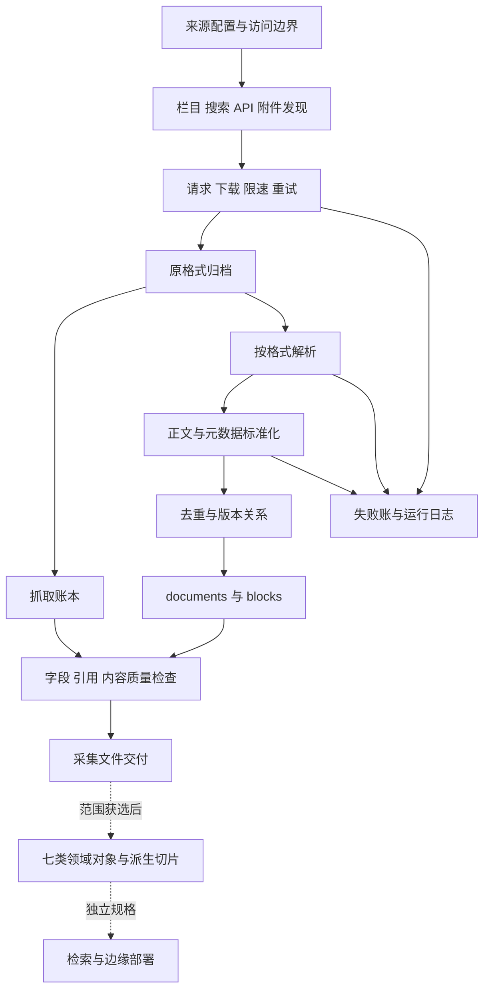

# 技术架构与实施计划

## 当前适用入口

已确认业务边界见 [raw 优先决定](raw-first-development.md)，当前实现缺口、任务顺序和完成标准统一见 [阶段六](stage-six.md)。本文历史阶段判断不覆盖该入口；已决定的范围不重复确认，已有能力不重新开发。

## 最新环境状态

2026-09-13 用户已提供目标 WSL 安装成功证据：/usr/bin/soffice，LibreOffice 24.2.7.2 420(Build:2)，uv run 下 find_soffice() 同样返回 /usr/bin/soffice。NEXT-04 已用该组件完成真实 OLE2 DOC/XLS 转换、结构保留、失败路径与原件追溯验证，T012 勾选完成，见 [NEXT-04 证据](evidence/next04-legacy-office.md)；受限沙箱内 5 项依赖组件的用例按能力探测 skip，已于 2026-09-13 在目标 Linux 正常 shell 复跑，13 项全部通过（详见证据文件）。第四阶段整体仍未完成（T019/T026/T027 与正式业务待决）。下文早期缺组件/权限记录按历史时点理解，不再作为等待安装的理由。

版本：0.1.0｜日期：2026-09-11｜状态：评审草案，尚未批准为实施基线

本计划提出以来源配置和适配器驱动的采集管线，以及可分离的领域加工模块。采集以原件、manifest、document、block 为主线，领域加工在范围获选后消费这些数据。以下模块划分、内部接口和恢复处理是本次设计建议；S1 的推荐程序目录和 S2 的采集器建议是依据，不意味着原文已指定每个新增模块。

## 开发约束

业务程序使用 Python，环境与依赖统一由 uv 管理；首先验证 Python 3.9 的完整环境，确实无法构建时才逐个次版本保守升级，框架及依赖组合仍待选。执行根目录 AGENTS.md 的 DEV-001—DEV-012，在 tech-stack.md 记录当前模块选型后再依赖这些技术实现。文档校验脚本的 Python 3.9+ 是辅助工具要求，不是项目运行版本。

依赖选型遵循 DEV-007：标准库和现有能力优先，成熟稳定版本优先；uv 默认排除预发布，必要依赖更新检查完整锁文件差异。具体流程见 tech-stack.md。

## 技术环境与选型状态

| 项目 | 候选设计或已知事实 | 状态 |
| --- | --- | --- |
| 工程形态 | 可批处理的采集程序，来源配置与站点适配器分开；不预设 Web 服务 | 设计建议 |
| 语言 | Python 3.9 优先；完整环境不成立才逐个次版本提高 | TD-01 已选 CPython 3.9.25（2026-09-11），当前范围无升级证据 |
| 环境与包管理 | 使用 uv 管理 Python、.venv、pyproject.toml、uv.lock、.python-version | 已验证：uv 0.11.28；三份配置与 dev 组已交付（T003） |
| 框架及依赖 | HTTP、HTML、YAML、测试与构建后端已选；PDF/OCR/Office、调度待在对应模块选型 | TD-02 部分选定，见 tech-stack.md 的 T002 已执行记录 |
| HTTP 和 HTML | requests 2.32.5；beautifulsoup4 + lxml 解析 | 样本验证通过（T002），运行依赖在 T006/T008 引入 |
| 文档解析 | 按 HTML、文本 PDF、扫描 PDF/OCR、DOC/DOCX、XLS/XLSX/CSV、JSON/XML 分适配接口 | HTML 已选；PDF/OCR/Office 库及旧格式路线待在 T011/T012 验证 |
| 存储与接口 | 原文件与 UTF-8 JSONL；必要的内部运行状态存储独立于交付契约 | 原文件/JSONL 来自 S1，状态存储为建议 |
| 调度 | 来源配置包含类型更新策略、周期与触发；运行参数按域生效 | 来源支持、实现方式待选 |
| 验证 | 固定原件夹具、类型检查、跨文件关系检查、故障注入和实际来源验收 | 基于原文质量目标的设计展开 |
| 目标平台 | 尚未确定；当前文档生成工作区为 Windows | Q13；不能推定服务器系统 |
| 规模性能 | 来源数、历史范围、容量、并发、完成期限未定 | Q11/Q13 |
| 领域与边缘 | 需要单独索引、模型、硬件与评测规格 | Q01/Q17；不在本计划虚构参数 |

## 架构



箭头表示逻辑依赖，不规定强制部署拓扑。可以在单进程实现；是否需要队列或数据库由规模决定。内部资料受控导入属于独立入口，不能接到公开 URL 发现队列。

## 模块职责与内部接口

以下接口是候选逻辑接口，不是已有 HTTP API；当前无需编造 OpenAPI 路由。

| 模块 | 输入 | 输出及职责 | 主要需求 |
| --- | --- | --- | --- |
| M01 来源配置 | 来源条目及已核验访问规则 | source_id、允许域/路径、策略和维护信息 | FR-001/002 |
| M02 发现与来源适配 | 来源配置、栏目/搜索响应、词包 | 待获取 URL、发现方式、触发词、引用页；站点专属稳定标识 | FR-003/004、KR-011/013 |
| M03 获取与原件账本 | 待获取资源和域参数 | 原件字节、请求/最终 URL、状态与 manifest；附件资源关系 | FR-005—008、NFR-003 |
| M04 格式解析 | 原件、MIME、source_id | 完整抽取正文、结构单元、位置、抽取方法和质量状态 | FR-010—012 |
| M05 标准化 | 解析结果及原件/账本关系 | 文档/块契约对象；清洗、语言、日期、URL 和缺失理由 | FR-009/013 |
| M06 去重版本 | 文档候选、历史数据和源状态 | 重复关系、版本沿革、下线状态；旧对象留存 | FR-014/015 |
| M07 更新和失败恢复 | 来源更新策略、操作状态 | 增量任务、补抓、失败账和状态记录 | FR-016/017、KR-012 |
| M08 校验和交付 | 所有记录、原件和日志 | 字段/关系/内容质量结果和六项采集成果 | FR-018—020、NFR-001/002/004 |
| M09 A B C G 领域 | 已选范围的文档和源证据 | 来源等级/立场、协定、表述、法律、术语和切片接口 | KR-001—004/009/010 |
| M10 D E F 与导入 | 文档证据、区域信息；另行授权内部输入 | 事件、文化、地理及受控导入关系 | KR-005—008 |

M04/M05 应可直接接收本地原件夹具，方便离线重解析；无需重新请求站点。M09/M10 不能反向改写原件或覆盖采集全文。

## 生命周期与恢复候选

内部操作记录建议经历 discovered → fetching → archived → parsed → normalized → validated。任一步可产生失败事件；partial 是内容解析状态，不能拿来替代抓取 HTTP 状态。这个生命周期是实现建议，未要求新增业务审核或发布状态。

原件先写入临时文件，字节完整后原子改名，再写 manifest；文档和块全部验证后成组提交，内部恢复记录说明提交是否完整。若中断留下未提交临时文件，恢复时核验哈希与提交状态，不盲目删除可用原件。manifest 可以多于 documents，因为列表页和解析失败资源仍是成功抓取资源。

重试记录保留每次尝试的状态；failed_records 按失败操作记账，运行日志保存跳过、重复命中和 HTTP 304。304 不携带新正文，引用上一次取得字节的资源；关联方式由 Q15 冻结。不得用“请求成功数 = 文档数”作错误对账公式。

正文重复与版本变化分开判断。相同 URL 的新内容是新版本候选；近似相同的法规可能仅改一条，不得因相似度抹掉修订。is_current 应表示来源证明的现行状态；缺乏状态证据时不自动认定最新抓取为现行。

## 工程目录与运行数据根

```text
docs/                        四份需求输入，与运行数据分开
specs/                       开发规格、契约、追踪和验收文档
.specify/memory/             项目原则
src/crawler/                 用户指定 src 布局下的采集业务包
  config/                    sources.yaml 与来源配置校验
  discover/                  list search sitemap api
  fetch/                     HTTP 与附件下载
  parser/                    按格式解析
  normalize/                 字段和结构标准化
  dedup/                     重复判断
  output/                    原件和 JSONL 写出
  monitor/                   日志和指标
  versioning/ schedule/ validate/ adapters/   本次设计补充
data/                        开发默认数据根，与 src/ 同级；生产可配置到工程外
  raw/<source_id>/<date>/<format>/
  manifests/crawl_manifest.jsonl
  manifests/failed_records.jsonl
  normalized/documents.jsonl
  normalized/blocks.jsonl
  logs/crawler.log
  logs/metrics.json
src/knowledge/               条件领域模块候选，不是已确认交付目录
tests/fixtures/              固定验收样本的工程位置建议
```

raw_path 相对于配置解析后的数据根，例如 raw/…；开发默认为项目根下 data/，生产由 CRAWL_DATA_DIR 设置绝对路径。目录与配置执行 [项目起步说明](project-startup.md)，Q14 的布局部分已有用户依据，仓库及发布策略仍待定。本套 specs/ 和 .specify/memory/ 只用于规格文件。不引入此前被审查指出无依据的 workspace/、deliveries/、batch_ 日期目录、document_refs.jsonl 或分类审核状态。

## 原则检查与实施顺序

已满足文档级检查：原文可定位、block/chunk 区分、版本不覆盖、候选设计标注、领域要求不遗漏。仍未满足实施基线：Q01 阶段选择、Q03—Q10 数据契约关键语义、Q11/Q13 验收范围和参数。不是全部工作必须停止，而是相关实现不能默默采用未批准假设。

实施按 tasks.md：先规格/契约与样本，再最小 HTML 加附件闭环，再扩展格式、增量恢复、全量追溯验收和入选站点验证。2026-09-11：采集侧 T003—T019 已有工程实现和夹具级证据（T012 真实旧格式转换、T019 正式验收仍未完成）（最小 HTML 加附件闭环、多格式解析、去重与版本、增量与失败恢复、日志对账、交付布局与 CFG-01—CFG-09）；同日按 FR-001/S3 C02 补上 robots.txt 规则执行（按主机缓存、最长匹配、4xx 放行 / 5xx 与网络失败保守拒绝，拒绝项按跳过或 `final_action=skip` 记录），全量 310 passed（含 AT 子句补强后新增的三类增量场景、来源级限速/超时/重试生效、AT-005 的正文分页与接口正文还原、AT-006/007/023 的身份保留与速率/并发分别建模、真实页面缺陷修复后的 2 项回归用例、T026 适配规则的 15 项用例与配置/契约漂移校验）；同日按用户许可分批对 4 个首批来源及其他 9 个权威来源做最小请求量核验（五轮共 69 请求、18 个登记来源均完成浅层核验，遵守 robots 与逐来源限速），记录 robots 判定、条件请求退化与站点约束（CN-03 全站 Disallow、CN-05/06/07 的 robots 508、IN-04/IN-07/IN-08/IN-09 的 robots 获取失败均保守拒绝，IN-03 域名别名，IN-10 空正文按 partial 记录，CN-04 空标题缺陷与本地重解析），见 [evidence/logs/t026-realsite-smoke.txt](evidence/logs/t026-realsite-smoke.txt) 与 [evidence/logs/t008-cn04-defect-fix.txt](evidence/logs/t008-cn04-defect-fix.txt)；并按 DEV-009 复核交付态：当前 uv.lock 40 个 registry 包与 202 条制品 URL 全部为登记清华镜像，在干净副本中以空缓存 `uv sync --locked` 成功并跑通测试（见 [evidence/logs/t019-lock-provenance.txt](evidence/logs/t019-lock-provenance.txt)），证据汇总见 evidence/。T026 的机制部分（逐来源适配规则：列表链接选择器/正则、分页终止条件、正文范围选择器）已在固定夹具与真实原件上实现并验证（见 [evidence/logs/t026-adapter-mechanism.txt](evidence/logs/t026-adapter-mechanism.txt)），逐来源取值与启用仍待 Q12/Q13。T020—T027 的其余部分仍受 Q01/Q12/Q13 等业务待决阻塞，尚未启动。领域对象可使用固定文档样本独立开发，但须先解决其范围和模型决策。检索/图谱/设备部署先形成独立规格，当前不承诺未知方案。

## 风险与处理

| 风险 | 影响 | 处理和证据 |
| --- | --- | --- |
| 两原文阶段不一致 | 采集工程被扩成未定义 RAG 系统 | Q01/Q17 明确选定范围；独立领域契约 |
| 来源改版或受限 | 入口和解析器失效 | 逐站点核验、固定样本、失败可复现；不绕过访问控制 |
| OCR 与结构抽取不完整 | 页码和引用失真 | 保存原件、方法与 partial；Q11 明确质量阈值 |
| 哈希/版本语义混乱 | 错误去重或覆盖现行版本 | Q04 冻结对象和规范化规则；使用条款变化样本验证 |
| 同名术语与争议立场合并 | 领域材料失去来源边界 | 保存地区、辖区、语言和来源；领域用例独立验收 |
| 总量和运行环境未给定 | 无法可信排期与容量估计 | Q13 先明确规模，再做可重复基准，不编造性能数字 |

镜像约束 DEV-009：Python 包必须使用登记镜像，不自动回退官方源；环境模板及来源验收按 [uv 模板说明](uv-template.md) 执行。

## 阶段续作与验证收敛

当前已有采集工程实现，按 [阶段续作说明](continuation.md) 的 DEV-010—DEV-012 推进有限交付项。适用测试通过后停止测试并交付，业务待决不触发无限夹具完善。用户允许遵守网站规则的有限真实测试；不重复请求同一授权，也不将其扩大为正式采集范围批准。历史测试数只代表对应记录，T012/T019 尚有真实组件/正式验收缺口。

## 阶段二复核后的续作入口

阶段三基线为阶段二提交 4f07c6f 之后的续作：NEXT-06—NEXT-08 已完成工程交付（统一请求预算与停止报告、CN-08 正文边界修复、随包契约与源码外安装），阶段候选一次全量回归 345 passed，证据见 [阶段三计划](stage-three.md) 与 [NEXT-06](evidence/next06-budget.md)、[NEXT-07](evidence/next07-cn08-body.md)、[NEXT-08](evidence/next08-packaged-contracts.md)。NEXT-04 仍受 Linux 组件权限阻塞，NEXT-05 仍待业务决定；不重复 NEXT-01/02 或全量测试来消耗等待时间。T012/T019/T026/T027 保留部分完成状态。

## 阶段三后的当前入口

NEXT-06/07/08 已由阶段三提交 d39bdc0 完成工程交付，历史候选回归 345 passed。NEXT-09 工程交付清单（[delivery-inventory.md](delivery-inventory.md)）与 NEXT-05A 决策确认栏（[decision-requests.md](decision-requests.md)）已交付，按 [阶段四交付收口](stage-four.md) 等待业务确认与 Linux 组件条件；保留 NEXT-04 环境阻塞及正式业务待决，T012/T019/T026/T027 不自动勾选完成。无新变更不重复测试或扩站。

## 2026-09-13 当前范围与续作

以 [当前范围与分块](scope-and-blocking.md) 为本轮入口：NEXT-09/NEXT-05A 已完成，NEXT-10 仅澄清原始结构分块与跨段语篇组合的差异。本轮不安排 RAG，T025 保留为范围外追踪且不勾选完成；T020—T024 为未选条件范围。原始业务需求和历史 AT 记录不删除，KR-010/AT-034 的检索部分不作为本轮验收门槛，来源相关 KR-011—KR-013 仍按已选范围处理。正式采集质量、来源与旧格式组件缺口继续保留，不因范围收敛自动通过。
